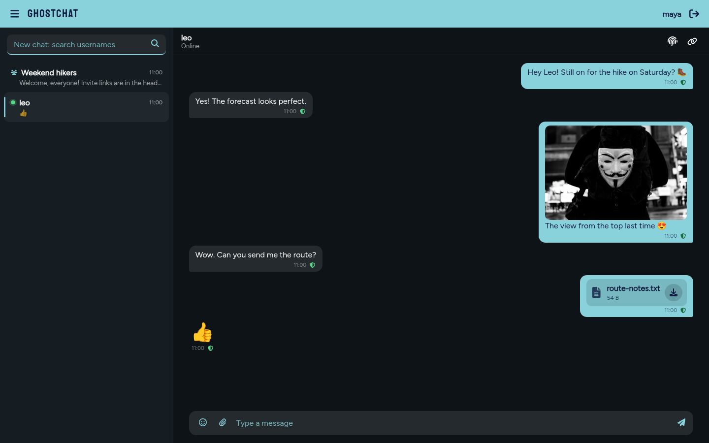
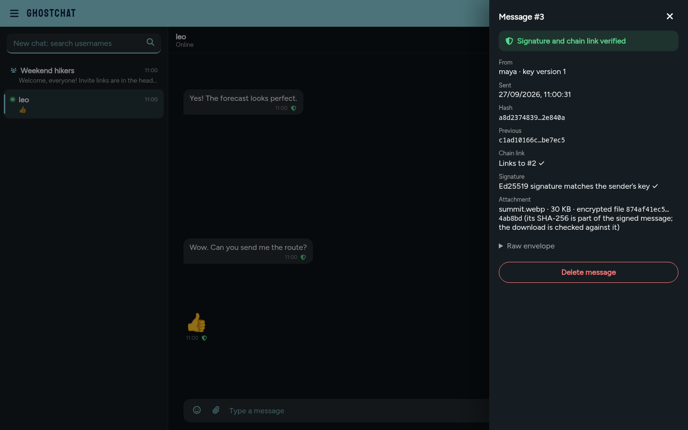
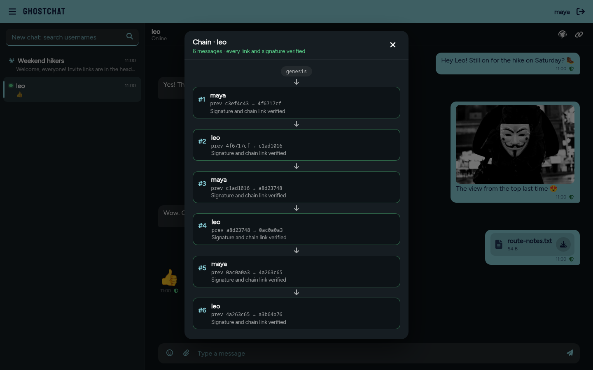
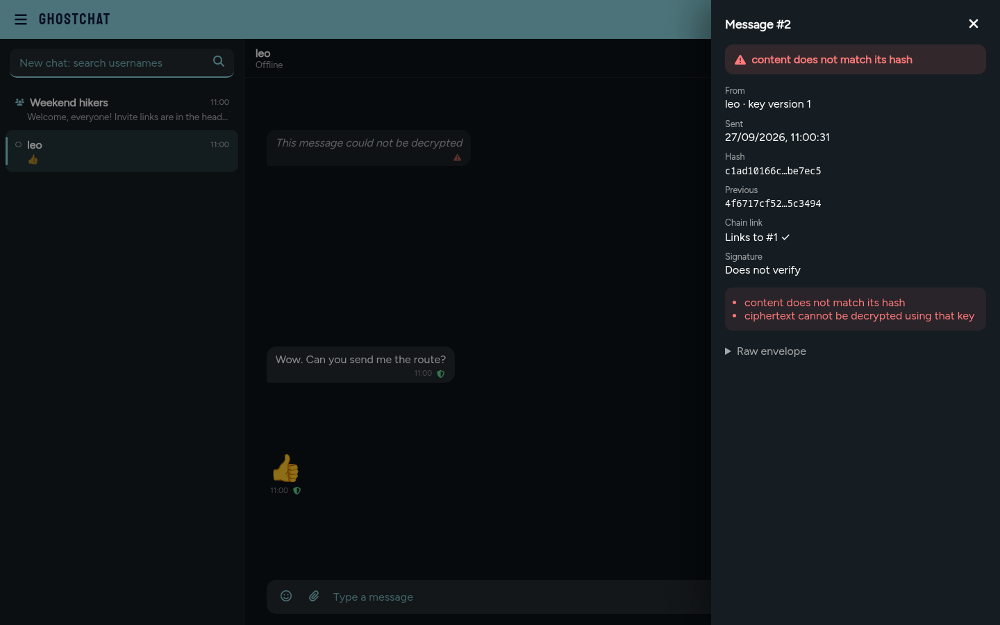
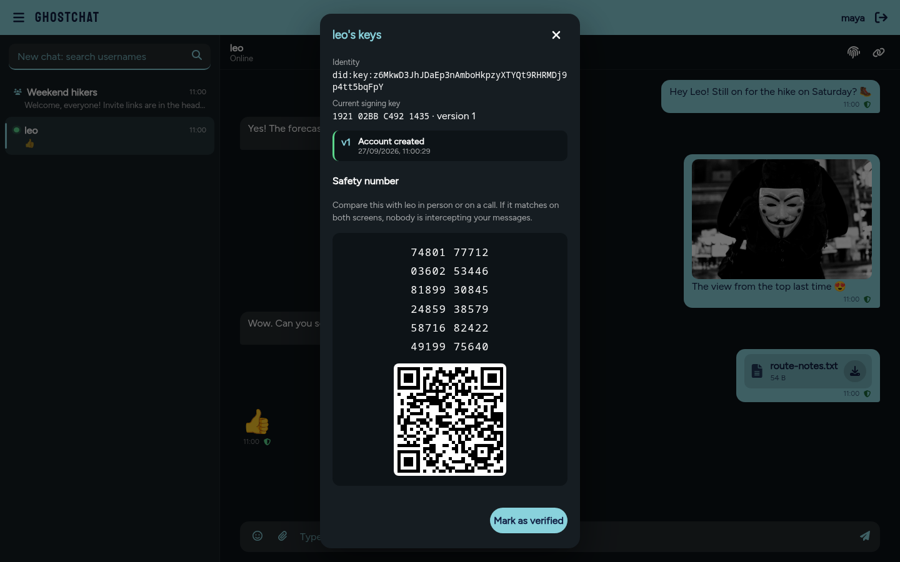
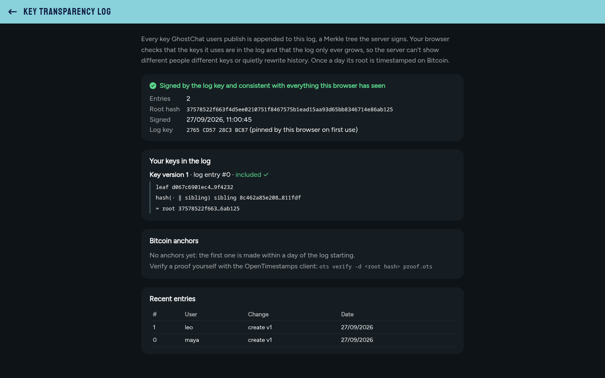
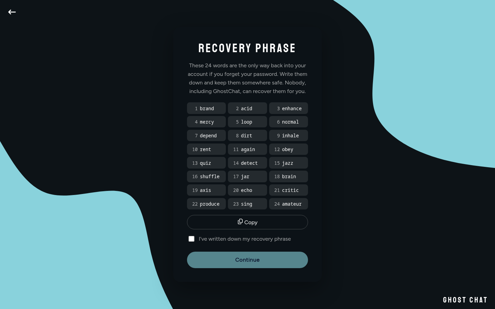
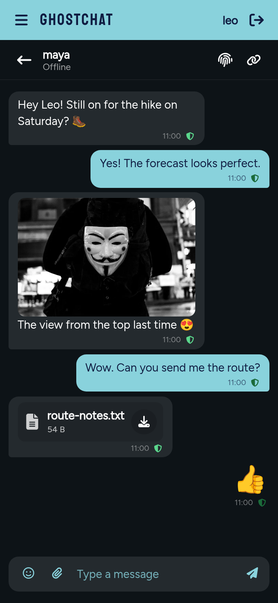

# GhostChat

[](https://github.com/MrtnOmwenga/GhostChat/actions/workflows/ci.yml)

End-to-end encrypted chat with disposable accounts. Sign up with a username and a password, no
email or personal details; talk directly or in invite-only rooms, and share photos and files.
Your browser encrypts and signs everything, and the server stores and relays ciphertext it
cannot read, forge or silently alter. Every one of those guarantees is visible in the app.

React (Vite, Redux Toolkit) · libsodium · Node.js (Express 5, Socket.IO) · MongoDB · Redis ·
Docker · Jest, Vitest, Playwright

**Security design:** [docs/DESIGN.md](docs/DESIGN.md) (threat model, key management, message
format, limitations).



## Highlights

- **End-to-end encryption in the browser.** Messages (XChaCha20-Poly1305) and files (libsodium
  `secretstream`) are encrypted before they leave the browser. End-to-end tests scan the whole
  database after real conversations: the text and file contents are never there.
- **Tamper-evident history.** Every message is signed (Ed25519) and linked by hash to the one
  before, so a server that edits, reorders or drops a message is caught. A shield on each message
  shows the result, and a Verify drawer shows the hashes, signature and raw envelope.
- **Keys you control, on any device.** Keys come from a 24-word recovery phrase and live in a vault
  that only your password opens (Argon2id). The server never receives the password: sign in on a
  new device and your history is there; forget the password and the phrase brings you back.
- **Verifiable identity for anonymous users.** Nobody gives their real name, but nobody can
  impersonate anyone: identities are `did:key` keys with a signed key history. Rotation is
  pre-committed (KERI-style), so a stolen key can't take over an identity. Safety numbers and QR
  codes let people confirm each other.
- **Key transparency log.** Every key ever published goes into an append-only Merkle tree (the
  Certificate Transparency design). Browsers check inclusion and consistency proofs, so the server
  can't show different people different keys, and the log's root is timestamped on Bitcoin daily
  through OpenTimestamps.
- **Encrypted photos and files.** Attach, paste or drop a file. Photos are re-encoded in the
  browser, which strips hidden metadata such as GPS position. Files are stored in MongoDB's
  GridFS, so there is no separate storage service to run or pay for.
- **Invite-only rooms.** Invite links carry their secret after the `#`, which browsers never send
  to the server. New members read the whole history; when someone leaves, the room key is replaced
  before anyone can send again.
- **Real-time and resilient.** Socket.IO with a Redis adapter for multiple instances. When two
  people send at the same instant, the one who loses the race rebases and resends automatically.
- **Deletion that means it.** Deleting a message or an account is a statement the author signs;
  the content and files are erased, and a signed marker keeps the chain verifiable.

## Screenshots

| Verify any message | The conversation as a chain |
|---|---|
|  |  |
| **A tampered message is flagged** | **Safety numbers** |
|  |  |
| **Key transparency log** | **Recovery phrase at sign-up** |
|  |  |

<p align="center">
  
</p>

## How it works

```
Browser (libsodium)                         Server
───────────────────                         ──────
password ─Argon2id─► authKey ──────────────► bcrypt(authKey)      (never the password)
                 └─► vaultKey ─ opens ─────► encrypted vault      (private keys)
recovery phrase ─► every key version
                                            key history + transparency log (Merkle tree)
message ─encrypt─sign─link─► envelope ─────► checks sender, signature, chain link
file ─re-encode─encrypt─► ciphertext ──────► GridFS, by hash      (participants only)
                                            MongoDB: ciphertext only
                                            Socket.IO (+ Redis adapter) relays envelopes
```

The built frontend is served by the same server as the API and the WebSocket, so everything is
one origin and the session cookie never crosses sites. [docs/DESIGN.md](docs/DESIGN.md) covers
each part in detail.

**Limits, stated plainly** (more in [the design doc](docs/DESIGN.md#10-limitations)):

- No forward secrecy yet: a leaked private key exposes messages sent to it. The Double Ratchet and
  MLS are the next step.
- The server still sees metadata: who talks to whom, when, and message and file sizes.
- Like every web app, the server delivers the code that does the encryption. Which code was published is a public record: the client build is reproducible, and each release signs its digest into Sigstore's log. The transparency page shows the digest and how to check it. A browser still can't check before running the code.
- Signatures prove authorship to anyone (no deniability): GhostChat chooses verifiability.

## Run it

```sh
echo "JWT_SECRET=$(openssl rand -hex 32)" > .env
docker compose up --build        # or: podman-compose up --build
```

Open http://localhost:5000, create two accounts in two browser windows (one private), search for
the other user and start chatting. To watch tamper detection, edit a stored message the way a
compromised server could, then reload:

```sh
cd backend && npm run tamper -- <conversation> <seq> [content|link]   # local databases only
```

## Tests

```sh
cd backend && npm test            # API, sockets, crypto, Merkle log, files (in-memory MongoDB)
cd frontend && npm test           # crypto module against published test vectors, state
cd e2e && npm install && npx playwright install chromium && npm test   # the whole app in a browser
```

- **Crypto** is tested against RFC 8032 (Ed25519), RFC 7748 (X25519), FIPS 180-2 (SHA-256) and
  BIP-39 vectors. Canonical-JSON vectors, a key-history fixture and Merkle proofs are shared by the
  frontend and backend suites, so the two implementations can't drift.
- **End-to-end tests** (Playwright) cover sign-up with the recovery phrase, sign-in on a new device
  with no password on the wire, recovery, encrypted messages, rooms and invites, photos and files,
  key rotation and reset, safety numbers, read receipts, deletion, and a compromised server
  editing messages, files and the key log, which the UI must flag.
- **Parallel and isolated:** each Playwright worker runs its own server and in-memory MongoDB, and
  CI splits the suite into shards.
- **Flaky tests are surfaced, not hidden:** CI fails a run whose tests only pass on retry
  (`failOnFlakyTests`), and a weekly [flake hunt](.github/workflows/flake-hunt.yml) runs every test
  10 times with no retries.

## Development

```sh
# backend (needs MongoDB; Redis optional)
cd backend
cp .env.example .env              # set JWT_SECRET
npm install
npm run dev                       # http://localhost:5000

# frontend
cd frontend
npm install
npm run dev                       # http://localhost:5173, proxies to the backend
```

<details>
<summary>Configuration</summary>

| Variable | Default | |
|---|---|---|
| `JWT_SECRET` | (required) | 32+ characters |
| `MONGODB_URI` | `mongodb://localhost:27017/ghostchat` | |
| `REDIS_URL` | unset | enables shared presence and the Socket.IO Redis adapter |
| `CORS_ORIGINS` | `http://localhost:5173` | comma-separated |
| `SESSION_HOURS` | `12` | |
| `SECURE_COOKIES` | `true` in production | set `false` only for plain-HTTP local runs |
| `EDGE_SECRET` | unset | when set, only requests carrying it in `X-Edge-Secret` are served (health check apart): the reverse proxy in front sends it, so the server's own address can't be used to go around the proxy |
| `CLIENT_IP_HEADER` | unset | the header the proxy puts the visitor's address in, used for rate limits; needs `EDGE_SECRET` |
| `STATIC_DIR` | unset | serve the built frontend from this folder |
| `LOG_SIGNING_KEY` | derived from `JWT_SECRET` | 64 hex characters; the transparency log's Ed25519 seed |
| `ANCHORING` | `on` in production | daily OpenTimestamps anchoring of the log |
| `OTS_CALENDARS` | two public calendars | comma-separated |
| `FILE_MAX_MB` | `10` | largest attachment |
| `FILE_QUOTA_MB` | `200` | stored attachments per user |

</details>

<details>
<summary>API</summary>

| | |
|---|---|
| `GET /api/auth/salt` · `POST /api/auth/register`, `/login`, `/logout`, `/password`, `/recovery` · `GET /api/auth/me`, `/vault`, `/recovery/challenge` | accounts |
| `GET /api/users/search?q=` · `GET /api/users/:id/keys` · `PATCH /api/users/me/settings` · `DELETE /api/users/me` | users, key histories, settings |
| `GET /api/rooms/mine`, `/:id` · `POST /api/rooms`, `/:id/invites`, `/:id/rotate`, `/:id/leave` · `DELETE /api/rooms/:id` | rooms |
| `GET /api/invites/:id` · `POST /api/invites/:id/accept` | invites |
| `GET /api/messages?conversation=` · `GET /api/messages/conversations`, `/receipts` · `POST /api/messages/delete` | encrypted history, receipts, signed deletions |
| `POST /api/files?conversation=` (encrypted bytes) · `GET /api/files/:id` | attachments, participants only |
| `POST /api/keys/rotate`, `/reset` | key changes |
| `GET /api/log/key`, `/head`, `/head/:size`, `/consistency`, `/entries`, `/users/:id`, `/anchors`, `/anchors/:id.ots` | transparency log (mostly public) |

Socket events: `message` (a signed envelope → `ok`, `conflict` with the missed messages,
`rotation-needed`, or `error`), `receipt`, `presence`, `room` (membership and key changes),
`keys-changed`.

</details>

## License

[MIT](LICENSE)
